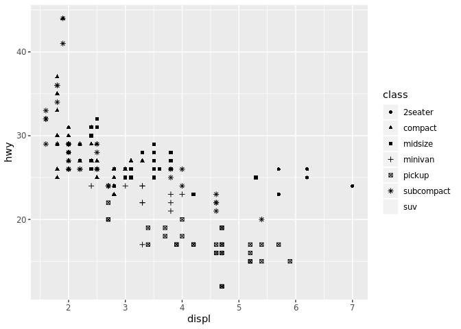

Ch. 3:Data Visualization
================

3.1 Prerequisites
-----------------

``` r
library(tidyverse)
```

    ## Registered S3 method overwritten by 'dplyr':
    ##   method               from  
    ##   as.data.frame.tbl_df tibble

    ## Registered S3 methods overwritten by 'ggplot2':
    ##   method         from 
    ##   [.quosures     rlang
    ##   c.quosures     rlang
    ##   print.quosures rlang

    ## ── Attaching packages ───── tidyverse 1.2.1 ──

    ## ✔ ggplot2 3.0.0     ✔ purrr   0.2.5
    ## ✔ tibble  1.4.2     ✔ dplyr   0.7.6
    ## ✔ tidyr   0.8.3     ✔ stringr 1.3.1
    ## ✔ readr   1.1.1     ✔ forcats 0.3.0

    ## ── Conflicts ──────── tidyverse_conflicts() ──
    ## ✖ dplyr::filter() masks stats::filter()
    ## ✖ dplyr::lag()    masks stats::lag()

``` r
library(ggplot2)
#> ── Attaching packages ────────────────────────────────── tidyverse 1.2.1 ──
#> ✔ ggplot2 3.1.0.9000     ✔ purrr   0.2.5     
#> ✔ tibble  2.0.0          ✔ dplyr   0.7.8     
#> ✔ tidyr   0.8.2          ✔ stringr 1.3.1     
#> ✔ readr   1.3.1          ✔ forcats 0.3.0
#> ── Conflicts ───────────────────────────────────── tidyverse_conflicts() ──
#> ✖ dplyr::filter() masks stats::filter()
#> ✖ dplyr::lag()    masks stats::lag()
```

3.2
---

#### Question:

Do cars with big engines use more fuel than cars with small engines? You probably already have an answer, but try to make your answer precise. What does the relationship between engine size and fuel efficiency look like? Is it positive? Negative? Linear? Nonlinear?

``` r
mpg
```

    ## # A tibble: 234 x 11
    ##    manufacturer model displ  year   cyl trans drv     cty   hwy fl    cla…
    ##    <chr>        <chr> <dbl> <int> <int> <chr> <chr> <int> <int> <chr> <ch>
    ##  1 audi         a4      1.8  1999     4 auto… f        18    29 p     com…
    ##  2 audi         a4      1.8  1999     4 manu… f        21    29 p     com…
    ##  3 audi         a4      2    2008     4 manu… f        20    31 p     com…
    ##  4 audi         a4      2    2008     4 auto… f        21    30 p     com…
    ##  5 audi         a4      2.8  1999     6 auto… f        16    26 p     com…
    ##  6 audi         a4      2.8  1999     6 manu… f        18    26 p     com…
    ##  7 audi         a4      3.1  2008     6 auto… f        18    27 p     com…
    ##  8 audi         a4 q…   1.8  1999     4 manu… 4        18    26 p     com…
    ##  9 audi         a4 q…   1.8  1999     4 auto… 4        16    25 p     com…
    ## 10 audi         a4 q…   2    2008     4 manu… 4        20    28 p     com…
    ## # ... with 224 more rows

Among the variables in mpg are: 1. displ, a car’s engine size, in litres. 2. hwy, a car’s fuel efficiency on the highway, in miles per gallon (mpg). A car with a low fuel efficiency consumes more fuel than a car with a high fuel efficiency when they travel the same distance.

### Plotting mpg

``` r
ggplot(data = mpg) + 
  geom_point(mapping = aes(x = displ, y = hwy))
```


### Graphing Template

ggplot(data = <DATA>) + <GEOM_FUNCTION>(mapping = aes(<MAPPINGS>))

### 3.2.4 Excersizes

1.  Run ggplot(data = mpg). Nothing shows up on this graph when I run it just like this

``` r
ggplot(data = mpg)
```

 2. How many rows are in mpg? How many columns? 3. What does the drv variable describe? Read the help for ?mpg to find out. 4. Make a scatterplot of hwy vs cyl. 5. What happens if you make a scatterplot of class vs drv? Why is the plot not useful?

3.3 Asthetic Mappings
---------------------

Mapping the colors of the points to the class

``` r
ggplot(data = mpg) + 
  geom_point(mapping = aes(x = displ, y = hwy, color = class))
```


Mapping size to class (ou get an error because this is not a good idea to use size)

``` r
ggplot(data = mpg) + 
  geom_point(mapping = aes(x = displ, y = hwy, size = class))
```

    ## Warning: Using size for a discrete variable is not advised.


Mapping class to the alpha aesthetic

``` r
ggplot(data = mpg) + 
  geom_point(mapping = aes(x = displ, y = hwy, alpha = class))
```

    ## Warning: Using alpha for a discrete variable is not advised.


``` r
ggplot(data = mpg) + 
  geom_point(mapping = aes(x = displ, y = hwy, shape = class))
```

    ## Warning: The shape palette can deal with a maximum of 6 discrete values
    ## because more than 6 becomes difficult to discriminate; you have 7.
    ## Consider specifying shapes manually if you must have them.

    ## Warning: Removed 62 rows containing missing values (geom_point).



Making the points blue

``` r
ggplot(data = mpg) + 
  geom_point(mapping = aes(x = displ, y = hwy), color = "blue")
```


You’ll need to pick a level that makes sense for that aesthetic: &gt;The name of a color as a character string.
&gt;The size of a point in mm.
&gt;The shape of a point as a number, as shown in Figure 3.1.

#### 3.3.1 Excersizes

1.  What’s gone wrong with this code? Why are the points not blue? &gt;ggplot(data = mpg) + geom\_point(mapping = aes(x = displ, y = hwy, color = "blue"))

The color argument should be listed outside of the parenthesis.

1.  Which variables in mpg are categorical? Which variables are continuous? Model, trans, fl, drv, and class are all qualitative variables. Displ, year, cyl, and cty are qualitative.

2.  Map a continuous variable to color, size, and shape. How do these aesthetics behave differently for categorical vs. continuous variables?

3.  What happens if you map the same variable to multiple aesthetics?

4.  What does the stroke aesthetic do? What shapes does it work with? (Hint: use ?geom\_point)

5.  What happens if you map an aesthetic to something other than a variable name, like aes(colour = displ &lt; 5)? Note, you’ll also need to specify x and y.

3.4 Common Problems
-------------------

How to Troubleshoot R Problems
&gt; Start by carefully comparing the code you are running to the code in the book
&gt; If the left-hand side of the console has a + it means that R doesn't think the expression is finished
&gt; If using ggplot2 make sure the + is at the end of a line, not the beginning
&gt; Using ?"Function name" if you are stuck on a function, check the examples
&gt; If this doesn't help, carefully read the error code for fixes

3.5 Facets
----------

A way to add additional variables with aesthetics
Facets are subplots that each display one subset of the data

> Structure of a facet
> ggplot(data = mpg) + geom\_point(mapping = aes(x = displ, y = hwy)) + facet\_wrap(~ class, nrow = 2)

### 3.5.1 Excersizes

1.  If the facet on a continuous variable it may produce too many subsets or the code may not run.
2.  Empty cells in a plot with facets indicate that there are no data point there.
3.  The following code makes two graphics, one with horizontal facets and one with vertical facets

``` r
ggplot(data = mpg) + 
  geom_point(mapping = aes(x = displ, y = hwy)) +
  facet_grid(drv ~ .)
```


``` r
ggplot(data = mpg) + 
  geom_point(mapping = aes(x = displ, y = hwy)) +
  facet_grid(. ~ cyl)
```

 4. The advanteges to using faceting instead of color aesthetic is that its color blindness friendly, and you don't have to worry about having colors that are too similar or "ugly" graphics 5. nrow, ncol 6. Facet\_grid() is helpful when you have two discrete variables

3.6 Geometric Objects
---------------------

Geom is the geometrical object that a plot uses to represent data, and people often describe plots by the type of geom that the plot uses

### 3.6.1 Exercises

1.  line chart: `geom_line()`, boxplot: `geom_boxplot()`, histogram: `geom_histogram()`, area chart: `geom_area()`
2.  This code will produce a scatter plot, with color assigned to the variable drv

``` r
ggplot(data = mpg, mapping = aes(x = displ, y = hwy, color = drv)) + 
  geom_point() + 
  geom_smooth(se = FALSE)
```

    ## `geom_smooth()` using method = 'loess' and formula 'y ~ x'

 3. show.legend = FALSE would hide the legend, if you remove it the legend will be default and will stay on the graph 4. se argument adds standard errors to the plot 5. These two plots will look the same, they are using the same data and a similar code.

``` r
ggplot(data = mpg, mapping = aes(x = displ, y = hwy)) + 
  geom_point() + 
  geom_smooth()
```

    ## `geom_smooth()` using method = 'loess' and formula 'y ~ x'


``` r
ggplot() + 
  geom_point(data = mpg, mapping = aes(x = displ, y = hwy)) + 
  geom_smooth(data = mpg, mapping = aes(x = displ, y = hwy))
```

    ## `geom_smooth()` using method = 'loess' and formula 'y ~ x'

 6.

3.7 Statistical Transformations
-------------------------------

> Bar charts, histograms, and frequency polygons bin your data and then plot bin counts, the number of points that fall in each bin.
> Smoothers fit a model to your data and then plot predictions from the model.
> Boxplots compute a robust summary of the distribution and then display a specially formatted box.

### 3.7.1 Exercises

1.  2.  geom\_col() and geom\_bar() have different default stats so they alter the data.
3.
